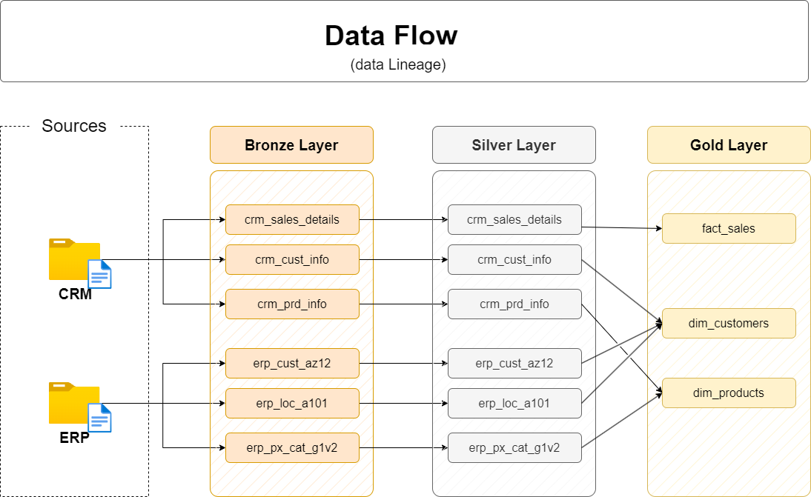

# 📦 Data Warehouse Project



A complete **Data Warehouse implementation** with ETL pipelines, schema design, tests, documentation and sample datasets — perfect for learning or showcasing data engineering skills.

## 🧠 Overview

This project demonstrates the design and implementation of a **data warehouse**, including:

* Extraction, transformation, and loading (ETL) of raw data
* Star schema or dimensional modeling
* Data quality validation
* Supporting tests and documentation

It is designed to be **reproducible** and easy to understand for others exploring data engineering and analytics pipelines.

## 🚀 What’s Inside

The repository is structured as follows:

```
/
├── datasets/         # Raw source datasets (CSV, JSON, etc.)
├── docs/             # Architecture diagrams, documentation, business rules
├── scripts/          # ETL and DDL SQL scripts or transformation code
├── tests/            # Data quality tests, validation scripts
├── README.md         # This file – project description & instructions
```

## 📂 Details

### 📁 `datasets/`

Contains one or more raw datasets used for building the warehouse — e.g., sales, customers, products. These are the **source files** the ETL will ingest.

### 📁 `docs/`

Documentation for:

* Data model (ER or star schema diagrams)
* ETL architecture
* Business logic and transformation rules

This helps explain your design decisions and project flow.

### 📁 `scripts/`

Houses all the code that builds and populates your data warehouse, such as:

* Schema definitions (CREATE TABLE)
* ETL scripts (INSERT/UPDATE or Python/SQL pipelines)
* Data cleansing and transformation

### 📁 `tests/`

Scripts or queries used to validate:

* Data accuracy
* Referential integrity
* Expected row counts and constraints

Tests provide confidence that your pipeline works as intended.

## 🛠️ Getting Started

### Requirements

List tools, versions, etc., needed to run / test the project. For example:

* SQL database (e.g., PostgreSQL, SQL Server, Redshift)
* Python 3.x (if Python ETL code)
* Any third-party packages (list requirements)

### Installation & Setup

1. **Clone the repo**

   ```bash
   git clone https://github.com/MatheusSabaudo/Data-Warehouse-Project.git
   cd Data-Warehouse-Project
   ```

2. **Prepare database**

   * Create database instance
   * Run initial schema scripts

3. **Load data**

   * Place dataset files into `datasets/`
   * Execute ETL scripts in `scripts/`

4. **Run tests**

   * Execute SQL or test scripts in `tests/` to verify data quality

## 🧩 Architecture

This project follows a typical **Data Warehouse architecture**:

1. **Staging** — raw data loaded into staging tables
2. **Transform** — business logic applied to cleanse and organize data
3. **Dimension & Fact tables** — structured for analytics and BI

## 📊 What You’ll Learn

By exploring this repository you will gain understanding of:

✔ ETL pipelines and data ingestion
✔ Data warehouse schema design
✔ SQL scripting and automation
✔ Data quality testing and validation
✔ Documentation of technical workflows

## 📖 Contributing

Contributions are welcome! You can:

* Add examples or sample queries
* Improve documentation
* Add tests or CI workflows

Just **fork**, make your changes, and submit a pull request.

## 📜 License

This repository uses an open‑source license (add license name here if present).
